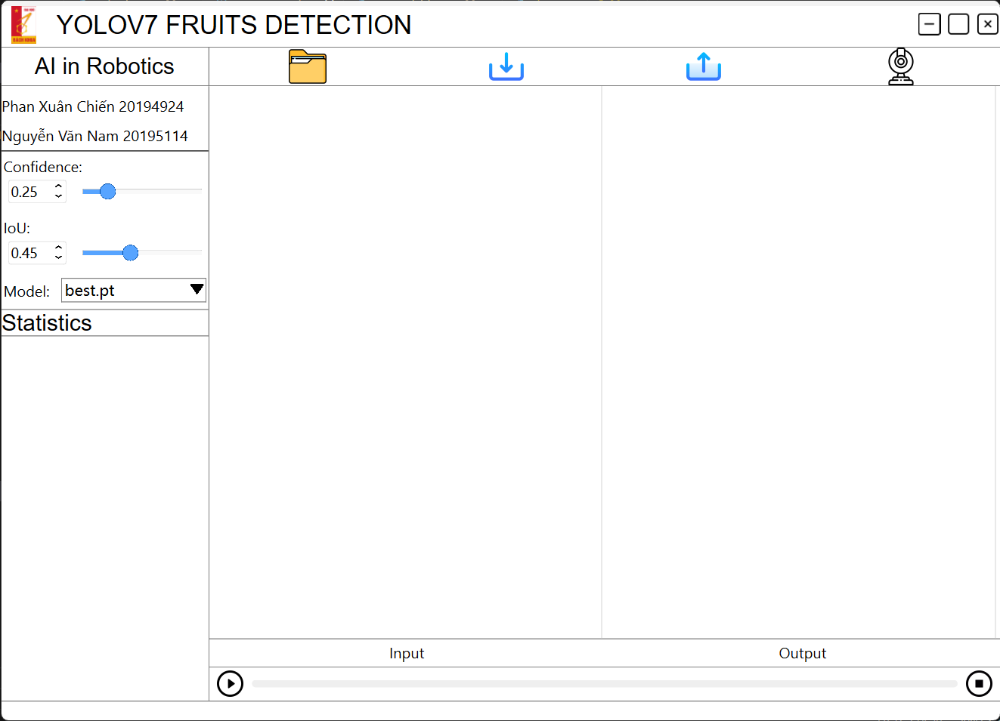

# Fruit_Detection_Yolov7_Pyside6

This project is based on [YOLOv7](https://github.com/WongKinYiu/yolov7) & [yolov7-Pyside6](https://github.com/SwimmingLiu/yolov7-Pyside6)

## Preview
<div align="center">
    <a href="./">
        
    </a>
</div>

## Run 
```bash
  python main.py
```

## Function

1. Support image/video/webcam as input
2. Change model
3. Change IoU
4. Change confidence
5. Play/Pause/Stop
6. Show statistics 
8. Export detected image/video(webcam)
9. Show FPS
10. Show results in LCD(i2c) via arduino

## Reference
- [WongKinYiu/yolov7](https://github.com/WongKinYiu/yolov7)
- [yolov7-Pyside6](https://github.com/SwimmingLiu/yolov7-Pyside6)
